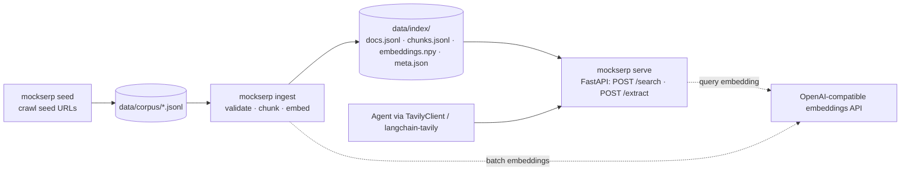

# Mock Tavily Search Engine — Design

Date: 2026-10-01
Status: Approved in brainstorming, pending written-spec review

## 1. Purpose

Our agents use web search, but the data they reason over is generated (fake), so real web search returns nothing useful. `mockserp` is a local search engine that **speaks the Tavily HTTP API**. Agents keep their existing Tavily tooling and change only the base URL, while results come from our own corpus.

The internals mimic a conventional web search engine: hybrid lexical and semantic ranking, one result per page, snippets drawn from the query-relevant parts of the page, domain and date filters, and a separate "fetch the page" step (`/extract`).

### Success criteria

1. `tavily-python` (`TavilyClient(api_key=..., api_base_url="http://localhost:8000")`) and `langchain-tavily` (`TavilySearch(api_base_url=...)`, `TavilyExtract(api_base_url=...)`) work against the mock with no code changes beyond the base URL and a dummy key. Both SDKs expose `api_base_url`; this was checked in the package sources (`tavily/tavily.py:72`, `langchain_tavily/_utilities.py:24,184`).
2. Queries naming invented entities, codes or exact phrases find the page that contains them.
3. Results are deterministic for a given index, query, parameters and `MOCK_NOW`.
4. A demo corpus of about 50 realistic crawled pages ships in the repo, so the demo runs without crawling again.

### Non-goals

- LLM answers: `include_answer` is accepted and `answer` is always `null`.
- Images: `images` is always `[]`.
- The `/crawl`, `/map`, `/research`, `/usage` and `/feedback` endpoints (all 404).
- Corpora beyond about 10k documents (see §10).
- Link-following crawl, PageRank, query rewriting.

## 2. Architecture



Lifecycle: `seed` (optional; refreshes the demo corpus) → `ingest` (full rebuild) → `serve` (loads the index once and keeps it read-only in memory). The only network call during a query is embedding the query text.

## 3. Components

All code lives in `src/mockserp/`. Each module has one job.

| Module | Responsibility | Depends on |
|---|---|---|
| `config.py` | `Settings` (pydantic-settings, env and `.env`), listed in §9 | — |
| `corpus.py` | `Document` model; reads and validates corpus JSONL; parses dates; normalizes URLs | — |
| `chunker.py` | `chunk(text) -> list[str]`: sentence-aware chunks of at most 500 characters, no overlap | — |
| `embedder.py` | `Embedder` protocol: `embed(texts: list[str]) -> np.ndarray` (float32, L2-normalized). `OpenAIEmbedder` implementation | `openai`, `numpy` |
| `index.py` | `build_index(corpus_dir, index_dir, embedder)` and `Index.load(index_dir)`. Holds documents, chunks, the embedding matrix and BM25 | corpus, chunker, embedder, `rank_bm25` |
| `search.py` | `search(index, embedder, params) -> list[Hit]`: filtering, hybrid retrieval, document roll-up, snippet selection. `extract(...)` chunk reranking | index |
| `api.py` | FastAPI app: Tavily request and response models, auth, error mapping, `/search`, `/extract` | search, config |
| `seed.py` | Polite crawler: seed URLs → corpus JSONL with a skip report | `httpx`, `trafilatura` |
| `cli.py` | `mockserp seed | ingest | serve` | all |

## 4. Data formats

### 4.1 Corpus (input)

`data/corpus/*.jsonl`, one page per line, in the shape Tavily uses for results:

```json
{"url": "https://www.energy.gov/eere/articles/how-does-pumped-storage-work", "title": "How Pumped Storage Hydropower Works", "raw_content": "# How ...markdown...", "published_date": "2024-05-14", "favicon": "https://www.energy.gov/favicon.ico"}
```

- Required: `url` (absolute http or https), `title` (non-empty), `raw_content` (non-empty Markdown or plain text).
- Optional: `published_date` (ISO 8601 date or datetime, or RFC 1123), `favicon` (URL).
- Validation errors stop the ingest and report the file and line number. A duplicate normalized URL anywhere in the corpus is an error.
- **URL normalization** (used for identity and for `/extract` matching): lowercase the scheme and host, drop the default port, drop the fragment, drop a trailing `/` from any non-root path, keep the query string. The original URL is what gets returned.

### 4.2 Index (output of ingest; `data/index/`, gitignored)

| File | Content |
|---|---|
| `docs.jsonl` | One `Document` per line; the line number is `doc_id` |
| `chunks.jsonl` | `{"doc_id", "ord", "text"}`; the line number is `chunk_id` |
| `embeddings.npy` | float32 `[n_chunks, dim]`, L2-normalized, row = `chunk_id` |
| `meta.json` | `{"embedding_model", "dim", "n_docs", "n_chunks", "corpus_sha256", "built_at"}` |

The index is built in a temporary sibling directory and renamed into place, so an interrupted ingest never leaves a partial index. BM25 is rebuilt from `chunks.jsonl` at load time; this takes milliseconds at the target scale, and nothing needs to be pickled.

## 5. Ingest

1. Load and validate every `*.jsonl` in `CORPUS_DIR`.
2. Chunk each `raw_content`: split into sentences (on `.`, `!` or `?` followed by whitespace, and on blank lines), then pack sentences greedily into chunks of **≤500 characters**. A single sentence longer than 500 characters is hard-split at the last whitespace before 500. Chunks never overlap. Joining a document's chunks with whitespace reproduces its text, apart from whitespace normalization.
3. Indexed text per chunk = `title + "\n" + chunk_text`. It is used for both BM25 tokens and embeddings, so deep chunks still match the page's subject.
4. Embed in batches of `EMBEDDING_BATCH_SIZE` (default 128), relying on the `openai` SDK's built-in retries.
5. Write the index (§4.2).

## 6. Retrieval and ranking (`/search`)

**Tokenizer (BM25 and `exact_match`):** lowercase, `re.findall(r"\w+", text)`. No stemming, no stopwords, so invented names and codes (`zentrix`, `q3`) match exactly.

**Pipeline:**

1. **Allowed-document filter** (before scoring, so filters never starve results):
   - `include_domains` with `include_domains_mode="restrict"` (the default): keep documents whose host equals a listed domain or ends with `"." + domain`. A leading `www.` on the document host or the listed domain is ignored.
   - `exclude_domains`: drop matches, using the same suffix rule. Exclude wins over include.
   - Date window (see below).
   - `exact_match=true`: every `"quoted phrase"` in the query (regex `"([^"]+)"`) must appear in the document: the phrase's token sequence must occur contiguously in the token sequence of `title + "\n" + raw_content` (same tokenizer, so case and punctuation are ignored, as in Tavily). A query with no quotes is unaffected. Quote characters are kept in the query used for BM25 and embeddings; the tokenizer drops them anyway.
2. **Lexical candidates:** BM25Okapi scores over chunks of allowed documents; take the top 50 with score > 0.
3. **Semantic candidates:** embed the query; dot product against the allowed chunks' rows; top 50.
4. **Fusion:** `rrf(c) = Σ_lists 1 / (60 + rank)`, with rank starting at 1.
5. **Document roll-up:** `doc_score = max rrf` over its candidate chunks. Sort by `(-doc_score, url)`. If `include_domains_mode="prefer"`, stable-partition so documents from included domains come first. Cut to `max_results`.
6. **Score field:** `score = doc_score / (2/61)`. 1.0 means ranked first in both lists. Always in (0, 1].
7. **Snippet (`content`):** the document's top candidate chunks by `rrf`, at most `chunks_per_source` (1 for `ultra-fast`), joined with ` [...] `, in score order. A document always has at least one candidate chunk.

**Date window:**
- "Now" is `MOCK_NOW` if set, otherwise the current UTC time.
- `time_range`: `day|d` = 1 day, `week|w` = 7, `month|m` = 30, `year|y` = 365, counting back from now.
- `start_date` and `end_date` are `YYYY-MM-DD` and inclusive. Any other format returns 400.
- Dated documents outside the window are dropped.
- Undated documents are **kept** unless `filter_by_published_date=true`, which matches Tavily's documented default.

There is deliberately no relevance cutoff: as with a real engine, weak queries still return the closest pages.

## 7. API contract

Checked against the official OpenAPI docs (`docs.tavily.com/documentation/api-reference/endpoint/search` and `/extract`) and the `tavily-python` client source.

### 7.1 Common

- Request bodies are JSON. **Unknown fields are ignored** (`extra="ignore"`), because the SDKs forward arbitrary keyword arguments.
- **Auth:** if `MOCK_API_KEY` is unset, every request is accepted, with or without `Authorization` (any dummy key works). If it is set, `Authorization: Bearer <MOCK_API_KEY>` is required; otherwise the response is 401.
- **Errors:** `{"detail": {"error": "<message>"}}` with status 400 (invalid value), 401 (auth) or 500 (internal, including embedding backend failure). FastAPI's default 422 validation body already matches Tavily's documented 422 shape. `tavily-python` maps 400 → `BadRequestError` and 401 → `InvalidAPIKeyError`.
- `request_id`: a fresh UUID4. `response_time`: seconds spent handling the request, rounded to 2 decimals.

### 7.2 `POST /search`

| Field | Type / range | Behavior |
|---|---|---|
| `query` | string, required | Blank after stripping → 400 |
| `max_results` | int 0–20, default 10 | 0 → empty `results` |
| `search_depth` | `basic|fast|advanced|ultra-fast`, default `basic` | All but `ultra-fast` use `chunks_per_source`; `ultra-fast` uses 1 chunk. Ranking is the same for every depth |
| `chunks_per_source` | int 1–3, default 3 | §6 step 7 |
| `include_domains`, `exclude_domains` | list[str] | §6 step 1 |
| `include_domains_mode` | `restrict|prefer` | Set without a non-empty `include_domains` → 400 |
| `time_range` | `day|week|month|year|d|w|m|y` | §6 date window |
| `start_date`, `end_date` | `YYYY-MM-DD` | §6 date window |
| `filter_by_published_date` | bool | Drops undated documents when a window is active; also turns on `include_published_date` |
| `include_published_date` | bool | Adds `published_date` to each result (`null` if undated). Turned on automatically by `topic="news"` |
| `exact_match` | bool | §6 step 1 |
| `include_raw_content` | `bool|markdown|text` | Any truthy value → stored `raw_content`; otherwise `null` |
| `include_favicon` | bool | Adds `favicon`: the corpus value, or `{scheme}://{host}/favicon.ico` |
| `include_usage` | bool | Adds `usage: {"credits": 2 if advanced else 1}` |
| `include_answer`, `include_images`, `include_image_descriptions`, `topic` (except the news-date rule), `country`, `auto_parameters`, `safe_search`, `language`, `filter_by_language`, `days`, `max_hours`, `timeout`, `fetch_timeout`, `cache_fallback` | — | Accepted and ignored |

Values outside the listed ranges or enums → 400 with the field named.

Response:

```json
{
  "query": "pumped hydro round-trip efficiency",
  "answer": null,
  "images": [],
  "results": [
    {
      "id": "3f2a9c1e",
      "title": "How Pumped Storage Hydropower Works",
      "url": "https://www.energy.gov/eere/articles/how-does-pumped-storage-work",
      "content": "chunk one... [...] chunk two...",
      "score": 0.83,
      "raw_content": null,
      "published_date": "Tue, 14 May 2024 00:00:00 GMT",
      "favicon": "https://www.energy.gov/favicon.ico"
    }
  ],
  "response_time": 0.12,
  "request_id": "9b0e7c1a-...",
  "usage": {"credits": 1}
}
```

- `id` = the first 8 hex characters of `sha1(normalized_url)`, so it is stable across requests.
- `published_date` (RFC 1123, GMT), `favicon` and `usage` are present only when requested.

### 7.3 `POST /extract`

| Field | Type / range | Behavior |
|---|---|---|
| `urls` | string or list[str], 1–20 | More than 20 or empty → 400 |
| `query` | string | Rerank the document's chunks against this query (§6 steps 2–4 limited to that document) |
| `chunks_per_source` | int 1–5, default 3 | Only used together with `query` |
| `include_favicon`, `include_usage` | bool | As in `/search` (`usage.credits` = 1) |
| `extract_depth`, `format`, `include_images`, `timeout` | — | Accepted and ignored |

Response: `{"results": [...], "failed_results": [...], "response_time", "request_id", "usage"?}`.

- A URL whose normalized form is in the corpus → `results[]`: `{url, raw_content, images: [], favicon?}`. Without `query`, `raw_content` is the full stored content. With `query`, it is the top `chunks_per_source` chunks joined with ` [...] `.
- Any other URL → `failed_results[]`: `{url, error: "Failed to fetch url"}`. HTTP status stays 200, as for unreachable pages on Tavily.
- `url` echoes the URL as the caller sent it. Results follow input order.

## 8. Demo corpus (`mockserp seed`)

- Input: `data/seeds.txt`, one URL per line (`#` comments allowed). It has about 60 URLs on **grid-scale energy storage** spread over several domains: Wikipedia (CC BY-SA), US government sites such as energy.gov, nrel.gov and eia.gov (public domain), and a few openly licensed explainers. A shared theme gives ranking and domain filters real competition.
- Crawl: one `httpx` GET per seed with no link following. `robots.txt` is checked with `urllib.robotparser`. The User-Agent is `mockserp-seed/0.1 (+demo corpus builder)`, there is 1 second between requests and a 20-second timeout.
- Extraction: `trafilatura` produces the main content as Markdown, plus metadata (title, date).
- A page is skipped and listed in the skip report on fetch failure, robots disallow, extracted text under 1,000 characters, or a duplicate normalized URL.
- Output: `data/corpus/demo.jsonl` (committed) and a summary on stdout with kept and skipped counts and reasons. Success target: at least 50 kept pages. If crawling cannot reach about 50 good pages, the fallback is LLM-generated pages; that becomes a separate decision raised with the user.

## 9. Configuration (`.env`, documented in `.env.example`)

| Variable | Default | Purpose |
|---|---|---|
| `EMBEDDING_BASE_URL` | `https://api.openai.com/v1` | OpenAI-compatible endpoint |
| `EMBEDDING_API_KEY` | — (required for ingest and serve) | |
| `EMBEDDING_MODEL` | `text-embedding-3-small` | Must match the index's `meta.json` at serve time |
| `EMBEDDING_BATCH_SIZE` | `128` | |
| `CORPUS_DIR` | `data/corpus` | |
| `INDEX_DIR` | `data/index` | |
| `MOCK_API_KEY` | unset | Enables bearer-key checking |
| `MOCK_NOW` | unset | ISO datetime pinning "now" for date filters |
| `HOST` / `PORT` | `127.0.0.1` / `8000` | |

## 10. Failure modes

| Situation | Behavior |
|---|---|
| Missing or invalid index at serve | Refuse to start; message tells you to run `make ingest` |
| `EMBEDDING_MODEL` ≠ `meta.json.embedding_model` | Refuse to start; message names both models |
| Embedding API error during a query | 500, `{"detail":{"error":"embedding backend unavailable: <reason>"}}`. No silent BM25-only fallback |
| Corpus validation error | Ingest exits non-zero with file:line and reason; the previous index is left untouched |
| Scale | Designed for ≤10k documents (everything in memory). Beyond that, replace `index.py` storage with SQLite FTS5 + sqlite-vec behind the same `search()` interface |

## 11. Tooling

- **uv** project with a `src/` layout, Python ≥3.12, `pyproject.toml` and `uv.lock` committed, and a `mockserp` console script.
- Runtime dependencies: `fastapi`, `uvicorn`, `pydantic-settings`, `openai`, `numpy`, `rank-bm25`, `httpx`, `trafilatura`.
- Dev dependencies: `pytest`, `ruff`, `tavily-python`.
- **Makefile** targets:

| Target | Command |
|---|---|
| `install` | `uv sync` |
| `seed` | `uv run mockserp seed` |
| `ingest` | `uv run mockserp ingest` |
| `serve` | `uv run mockserp serve` |
| `test` | `uv run pytest` |
| `lint` | `uv run ruff check . && uv run ruff format --check .` |
| `fmt` | `uv run ruff format . && uv run ruff check --fix .` |
| `demo` | Runs a few real queries and one extract through `TavilyClient(api_base_url=...)` against a running server |

- `.gitignore`: `data/index/`, `.env`, `.venv/`.

## 12. Testing

- **Unit tests** need no network: a deterministic `HashEmbedder` implements `Embedder` by hashing tokens into a fixed-dimension vector and normalizing it.
  - Chunker: every chunk ≤500 characters; sentence boundaries respected; over-long sentences hard-split; no text lost.
  - Corpus: required fields, duplicate normalized URLs, date parsing, URL normalization cases.
  - Filters: suffix matching (`example.com` matches `blog.example.com` but not `notexample.com`), exclude beats include, `prefer` ordering, undated documents kept or dropped by `filter_by_published_date`, `MOCK_NOW`, invalid dates → 400.
  - Ranking: an invented-name query is found through BM25 even when embeddings disagree; one result per document; tie-break by URL; score range; snippet chunk count per depth.
  - `exact_match` with and without quotes.
- **Contract tests:** a pytest fixture builds a small fixture index with `HashEmbedder`, runs uvicorn on a free port and drives it with the **real `tavily-python` client**. Covered: `search` with the main parameters, `extract` (found, missing, query rerank), the 401 → `InvalidAPIKeyError` and 400 → `BadRequestError` mappings, and unknown kwargs being accepted.
- **Smoke:** `make ingest && make serve` with the real embedding API, then `make demo`.
