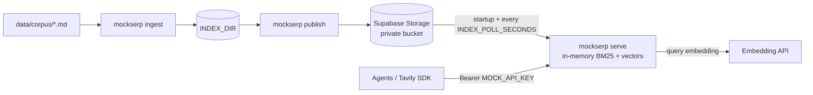

# Supabase-hosted index, Markdown corpus, and deployment — Design

Date: 2026-10-06
Status: Draft, pending written-spec review
Builds on: [`2026-10-01-mock-tavily-search-engine-design.md`](2026-10-01-mock-tavily-search-engine-design.md). Everything in that spec stays true unless this document says otherwise. This change replaces its §4.1 (JSONL corpus) and removes its §8 (demo corpus and `seed` crawler).

## 1. Purpose

Today `mockserp` reads its corpus and index from local files (`data/corpus/*.jsonl` → `data/index/`). This change does three things:

1. **Markdown-only corpus.** The Vietnamese real-estate papers (18 pages, 72 KB) become the corpus, as `data/corpus/*.md`. Each file already has YAML front matter with `url`, `title`, and `published_date` (added 2026-10-06). JSONL corpus input, the English energy demo (`data/corpus/demo.jsonl`), and the `seed` crawler that produced it are removed.
2. **Index in Supabase.** `ingest` still builds the index locally. A new `publish` command uploads it to a private Supabase Storage bucket. A deployed server downloads the current version at startup and loads new versions without restarting.
3. **Deployment-ready.** A container image that runs on any container host, configured only through environment variables, with an API key required whenever the server is reachable from outside the machine. Adds a health endpoint and CI.

### Success criteria

1. `mockserp ingest` with the default `CORPUS_DIR` indexes all 18 papers. `mockserp publish` uploads the result.
2. A container started with `INDEX_SOURCE=supabase` and no local data serves `/search` and `/extract` over that index through the official `tavily-python` client.
3. After a new `publish`, a running server serves the new version within `INDEX_POLL_SECONDS` without a restart, and `/healthz` reports the new version.
4. These Vietnamese queries over the real-estate corpus, with real embeddings, return the expected results:
   - `"giải ngân gói tín dụng 145.000 tỷ nhà ở xã hội"` → paper 3 ranked first.
   - `"giá thuê văn phòng hạng A 64,7 USD/m²"` → paper 17 ranked first.
   - query `"39.000 sản phẩm"` (the double quotes are part of the query) with `exact_match=true` → exactly papers 14 and 18, the only papers containing that token sequence.
   - `MOCK_NOW=2026-10-06T00:00:00Z`, `time_range="week"`, `max_results=20` → exactly papers 1, 2, 13, 14, 15, 16.
5. `serve` exits with an error if it would bind to a non-loopback host while `MOCK_API_KEY` is unset.
6. `make test` passes offline. CI runs lint, the test suite, and a Docker image build on every push and pull request.

### Non-goals

- Searching inside Postgres (pgvector or full-text search). The corpus has 18 pages, and Postgres has no Vietnamese text-search configuration. Ranking stays in Python, unchanged.
- Editing pages in Supabase. Pages are authored as files; Supabase holds built index versions only.
- Serving several corpora from one deployment. One deployment serves one published index.
- Choosing a hosting platform, pushing to a container registry, or infrastructure-as-code.
- Cleaning Google Docs export escapes (`\-`, `\[1\]`) out of the papers. `raw_content` stays verbatim.
- Changing the embedding model. `text-embedding-3-small` stays the default. If success criterion 4 fails, model choice gets revisited as a separate change.
- Crawling real web pages. `seed`, `data/seeds.txt`, and the `trafilatura` dependency are removed; git history keeps them.

## 2. Decision: Storage bucket, not Postgres tables

| Option | Verdict |
|---|---|
| **C. Built index in Supabase Storage** (chosen) | Reuses the existing index format byte for byte. About one new module. No schema, no migrations, no database driver. Fits the actual workflow: a generator writes Markdown files, then ingest runs. |
| A. `documents` and `chunks` tables (pgvector) loaded into memory at startup | Pages could be browsed and edited in the dashboard, and other services could insert them. Costs `psycopg` and `pgvector` dependencies, SQL migrations, and tests that need a Postgres database. Nobody edits pages outside files today. Revisit A if that changes. |
| B. Ranking inside Postgres | Rejected: no Vietnamese text-search configuration, ranking is not true BM25, and the size doesn't need it (see Non-goals). |

## 3. Architecture



Lifecycle: `ingest` (local build, unchanged except for the input format) → `publish` (upload a version, move the pointer) → `serve` (loads from `INDEX_DIR` or Supabase; in Supabase mode, keeps polling for new versions).

## 4. Components

| Module | Change |
|---|---|
| `corpus.py` | `load_corpus` reads `*.md` instead of `*.jsonl` (§5). The front-matter fields go through the existing `_parse_row` validation. |
| `index.py` | `tokenize` normalizes Unicode to NFC before lowercasing (§5.3). `build_index` adds `version` to `meta.json` (§6.1). `_corpus_sha256` hashes `*.md`. The index's own `docs.jsonl`/`chunks.jsonl` are unchanged: they are a generated index format, not corpus input. |
| `seed.py` | Deleted, along with `tests/test_seed.py`, `data/seeds.txt`, and `data/corpus/demo.jsonl`. |
| `remote.py` (new) | `IndexStore`: publish, read the current pointer, fetch a version, prune old versions. Works against a narrow `Bucket` protocol (`upload`, `download`, `list`, `remove`). `SupabaseBucket` adapts the official `supabase` Python SDK to that protocol. |
| `live.py` (new) | `LiveIndex`: holds an immutable `(index, version)` snapshot that is swapped atomically. `refresh(store, live, expected_model)` performs one polling step. |
| `api.py` | `create_app` takes a `LiveIndex` instead of an `Index`. Each request reads the snapshot once. Adds `GET /healthz`. A lifespan task runs the poller when one is configured. |
| `cli.py` | Removes `seed`. New `publish` command. `serve` picks the index source and enforces the bind/auth guard. |
| `config.py` | New settings (§9). |
| `scripts/demo.py` | Its English energy-storage queries are replaced with Vietnamese queries over the papers, including the success criterion 4 cases. |
| Repo | `Dockerfile`, `.dockerignore`, `.github/workflows/ci.yml`, README, and `.env.example`. Makefile: removes `seed`, adds `publish` and `docker`. The papers move from `data/` to `data/corpus/` and get committed. |

Dependencies: adds `pyyaml` (front matter) and `supabase` (Storage SDK); removes `trafilatura`.

## 5. Markdown corpus

### 5.1 File format

```markdown
---
url: "https://batdongsan-phantich.example/<ascii-slug-of-title>-<yyyymmdd><NN>.html"
title: "<title from the H1, without ** bold markers>"
published_date: "2026-09-29"
---

# **Original H1** …body…
```

- The opening `---` must be the file's first line. The front matter ends at the next line that is exactly `---`. It must parse with `yaml.safe_load` to a mapping.
- Field rules: `url` (absolute http(s) URL, unique across the whole corpus) and `title` (non-empty) are required; `published_date` (ISO 8601 or RFC 1123) and `favicon` are optional; other keys are ignored. YAML may parse an unquoted date as a `date` or `datetime`; these are turned into ISO strings before `parse_date`.
- `raw_content` is the text after the closing `---`, with leading blank lines removed, and must not be empty. The H1 stays in `raw_content`, as on a real web page.
- A file without front matter is an error. The title is never guessed from the H1.
- Errors name the file (`paper-RE (3).md: url must be an absolute http(s) URL, got None`) and raise `CorpusError`, so `ingest` exits non-zero and the previous index survives.

### 5.2 Discovery

`load_corpus(corpus_dir)` loads every `*.md` directly inside `corpus_dir` (no recursion), one page per file, in sorted filename order, and rejects duplicate URLs across files. A `.jsonl` file in the directory is ignored like any other non-`.md` file. An empty result is an error: "no documents found in <dir>/*.md".

### 5.3 Unicode

`tokenize` applies `unicodedata.normalize("NFC", text)` before lowercasing. This affects BM25, `exact_match`, and query tokens. The papers are already NFC; this stops a decomposed (NFD) query, which some Vietnamese input methods produce, from missing every lexical match. Chunk text and `raw_content` are not normalized: they are returned verbatim.

### 5.4 URL scheme (already applied)

- `.example` is a reserved TLD that never resolves, so an agent fetching the URL outside the mock fails safely and can't hit a real site.
- The path is the title with accents removed (`đ` → `d`) and non-alphanumerics replaced by `-`, followed by `-<yyyymmdd><NN>.html`. `NN` is the paper's file number. The suffix keeps near-duplicate titles (10/12, 11/13, 14/18) unique.
- New papers follow the same scheme. Suffix numbers are never reused.

## 6. Publishing (`mockserp publish`)

### 6.1 Version identity

`build_index` writes `meta["version"] = f"{built_at:%Y%m%dT%H%M%SZ}-{corpus_sha256[:8]}"`. The timestamp prefix makes versions sort chronologically by name. `publish` refuses an index whose `meta.json` has no `version`, with the message "rebuild with `mockserp ingest`".

### 6.2 Bucket layout

Bucket `SUPABASE_BUCKET` (default `mockserp-index`), private:

```
versions/<version>/meta.json
versions/<version>/docs.jsonl
versions/<version>/chunks.jsonl
versions/<version>/embeddings.npy
current.json        {"version": "<version>", "embedding_model": "...", "published_at": "<ISO 8601 UTC>"}
```

### 6.3 Steps

1. Load `INDEX_DIR` with `Index.load` to check it's consistent before uploading anything.
2. Create the bucket (private) if it doesn't exist.
3. Upload the four files under `versions/<version>/`, overwriting any existing objects, so re-publishing the same version is safe.
4. Upload `current.json` last, overwriting the old one. Readers therefore see either the old complete version or the new complete version, never a partial one.
5. Prune: keep the current version and the `--keep − 1` newest versions named before it (`--keep` defaults to 3), and delete every older version. Versions named after the current one are left alone, because another publish may be uploading them. A prune failure prints a warning; the publish still succeeds.
6. Print `published <version> (<n_docs> docs, <n_chunks> chunks)`.

If an upload fails in steps 2–4, `publish` exits non-zero and `current.json` is unchanged. On a failure in step 3, `publish` makes a best-effort deletion of the objects it already uploaded for that version, so a partial version can't take a retention slot. Files above the project's Storage size limit (50 MB on the Free plan) fail with Storage's error message passed through. The real-estate index is about 1–2 MB.

## 7. Serving

### 7.1 Index source

`INDEX_SOURCE=local` (default): load `INDEX_DIR` as today; no polling.
`INDEX_SOURCE=supabase`:

1. Read `current.json`. If it's missing: exit 1 with "nothing published to bucket <name>; run `mockserp publish`".
2. Download the version's four files into a `tempfile.TemporaryDirectory`, load them with `Index.load`, then delete the directory. The index lives entirely in memory.
3. Apply the existing embedding-model check (`meta.embedding_model == EMBEDDING_MODEL`, else exit 1).
4. Start uvicorn with a `LiveIndex` and a poller.

### 7.2 Hot swap

- **Snapshot:** `LiveIndex.current` is one immutable `Snapshot(index, version)`. A swap is a single attribute assignment. Every request reads `live.current` once and uses that snapshot throughout, so a request never mixes two versions.
- **Polling:** the poller is an asyncio task started in the FastAPI lifespan. Every `INDEX_POLL_SECONDS`, it runs `refresh` in a worker thread (`asyncio.to_thread`). `refresh` reads `current.json`; if the version differs from the one loaded, it downloads and loads the new version, checks its embedding model, and swaps.
- **Failures:** any refresh failure logs one error line and keeps serving the old snapshot; the next tick tries again. This covers network errors, a version pruned mid-download, `IndexLoadError`, and an embedding-model mismatch.
- `INDEX_POLL_SECONDS=0` disables polling.
- **Memory:** a swap briefly holds two indexes in memory. That's negligible at the target size.
- **Workers:** one uvicorn worker per container. Scale by running more containers. Each container polls independently, so for up to one poll interval, different containers can serve different versions.

### 7.3 `GET /healthz`

No authentication. Always returns `200 {"status": "ok", "index_version": "...", "embedding_model": "...", "n_docs": N}`. In local mode, `index_version` is `meta.version`, or `null` for indexes built before this change. Hosting platforms use it for health checks, and operators use it to confirm a swap happened.

### 7.4 Bind/auth guard

`serve` exits 1 with "refusing to serve on <host> without MOCK_API_KEY" when `MOCK_API_KEY` is unset and `HOST` is anything other than `127.0.0.1`, `::1`, or `localhost`. Without this, a public deployment would let anyone spend the embedding-API budget. Local `make serve` is unaffected.

## 8. Packaging and CI

### 8.1 Dockerfile (multi-stage)

- Build stage: `ghcr.io/astral-sh/uv` with Python 3.12, `uv sync --frozen --no-dev --no-editable` into `/app/.venv`.
- Runtime stage: `python:3.12-slim`, copies only the venv, runs as a non-root user, `ENV HOST=0.0.0.0 INDEX_SOURCE=supabase PYTHONUNBUFFERED=1`, `CMD ["mockserp", "serve"]`. `PORT` comes from the platform (default 8000).
- The image contains no corpus, index, or `.env`. `.dockerignore` excludes `data/`, `.env`, `.venv`, `tests/`, caches, and `docs/`.
- Ingest and publish run from a developer machine (or a one-off `docker run … mockserp publish` with a mounted `INDEX_DIR`), never inside the server.

### 8.2 GitHub Actions (`.github/workflows/ci.yml`)

On push and pull request: `uv sync --frozen` → `ruff check` + `ruff format --check` → `pytest` → `docker build`. No secrets are needed; tests are offline. Pushing images to a registry is out of scope.

### 8.3 Makefile

Removes `seed`. Adds `publish` (`uv run mockserp publish`) and `docker` (`docker build -t mockserp .`). `demo` stays.

## 9. Configuration

Additions to `Settings` and `.env.example`. `.env`-over-shell precedence is unchanged; containers have no `.env` and read the environment.

| Variable | Default | Used by |
|---|---|---|
| `INDEX_SOURCE` | `local` | `serve`: `local` or `supabase` |
| `SUPABASE_URL` | unset | `publish`, `serve` (supabase) |
| `SUPABASE_SECRET_KEY` | unset | `publish`, `serve` (supabase). A server-only `sb_secret_…` key. Never ship it to clients or commit it. |
| `SUPABASE_BUCKET` | `mockserp-index` | `publish`, `serve` (supabase) |
| `INDEX_POLL_SECONDS` | `60` | `serve` (supabase); `0` disables polling |

`publish` and `serve` with `INDEX_SOURCE=supabase` exit 1 with a message naming each missing variable when `SUPABASE_URL` or `SUPABASE_SECRET_KEY` is unset.

`SUPABASE_URL` must be the project base URL (`https://<ref>.supabase.co`). A value with a path, such as `https://<ref>.supabase.co/rest/v1/`, fails settings validation with a message showing the corrected base URL. With the path, Storage calls reach the database REST endpoint and fail with 404 `PGRST125` (observed 2026-10-06). A trailing `/` alone is accepted.

Deployment environment (set in the platform's secret store): `INDEX_SOURCE=supabase` (set by the image), `SUPABASE_URL`, `SUPABASE_SECRET_KEY`, `EMBEDDING_API_KEY`, `EMBEDDING_BASE_URL` / `EMBEDDING_MODEL` if not the defaults, and `MOCK_API_KEY`.

## 10. Failure modes

| Situation | Behavior |
|---|---|
| `publish` upload fails | Exit 1; `current.json` unchanged; servers keep the current version |
| `serve` (supabase) at startup: Supabase unreachable, nothing published, or download/load fails | Exit 1 with the reason; the platform restarts the container |
| Poll fails (network, pruned version, corrupt files, model mismatch) | Log one line; keep serving the old snapshot; retry next tick |
| Corpus error in a `.md` file | `ingest` exits 1 naming the file; the previous local index is untouched |
| `HOST` not loopback and no `MOCK_API_KEY` | `serve` exits 1 |
| Embedding API down during a query | Unchanged: 500 `{"detail": {"error": …}}` |

## 11. Risks

- **`sb_secret_` keys with Storage.** The new secret keys aren't JWTs. Raw Storage REST calls with them have reported auth mismatches ([supabase/agent-skills#280](https://github.com/supabase/agent-skills/issues/280)), which is why this design goes through the official `supabase` SDK. The first implementation step is to upload, download, list, and remove one object with the SDK and an `sb_secret_` key against a real project, before any other code. If that fails, switch `SupabaseBucket` to Supabase's S3-compatible endpoint with S3 access keys (`boto3`). That change stays behind the `Bucket` protocol and changes only §9's credential variables. Legacy `service_role` JWTs are not a fallback: Supabase deprecates them by the end of 2026.
- **Vietnamese retrieval quality** with `text-embedding-3-small` is unmeasured. Success criterion 4 measures it. The lexical side (BM25 on whole syllables, NFC) carries the exact-figure queries.
- **Mixed-version window** across replicas, up to one poll interval (§7.2). Acceptable for a mock.

## 12. Testing

Offline (`make test`), following the existing conventions (`HashEmbedder`, `tmp_path` corpora):

- **Markdown loader:** valid file → `Document` with `raw_content` starting at the H1; missing front matter, unterminated front matter, non-mapping YAML, missing `url`, and empty body are each rejected with the filename; an unquoted YAML date is accepted; a duplicate URL across two `.md` files is rejected; a `.jsonl` file in the directory is not loaded.
- **NFC:** an NFD-encoded query matches an NFC document through BM25 and `exact_match`.
- **`IndexStore`** against an in-memory fake `Bucket`:
  - Publish writes the version files before the pointer.
  - An upload failure leaves the previous `current.json` in place and removes the partial version's objects.
  - Prune keeps the current version plus the `keep − 1` newest older versions, and leaves versions named after the current one alone.
  - Fetch round-trips to an `Index` equal to the published one.
- **`LiveIndex`/`refresh`:**
  - A new version swaps the snapshot.
  - The same version is a no-op.
  - A failed download, a load error, or a model mismatch keeps the old snapshot.
- **API:** `/healthz` without auth reports the version. After a swap, `/search` serves the new index's documents.
- **CLI:** non-loopback host without `MOCK_API_KEY` exits 1; `INDEX_SOURCE=supabase` without credentials exits 1 naming the variables; `SUPABASE_URL` with a path is rejected with the corrected base URL; `publish` rejects an index without `version`.
- Existing tests that construct `create_app(index, …)` move to `LiveIndex`. Existing tests that write JSONL corpora (`conftest.write_corpus`, `test_corpus.py`, `test_cli.py`, `test_index.py`) switch to `.md` files; JSONL-specific cases (per-line error locations, blank lines) are deleted.

Manual smoke checks (need a Supabase project or a local `supabase start` stack, plus an embedding key):

1. SDK probe from §11.
2. `make ingest && make publish`, then the success criterion 4 queries through `tavily-python` against a `docker run` container with `INDEX_SOURCE=supabase`.
3. Re-ingest after editing one paper, `make publish`, and watch `/healthz` change version within `INDEX_POLL_SECONDS` without a restart.
